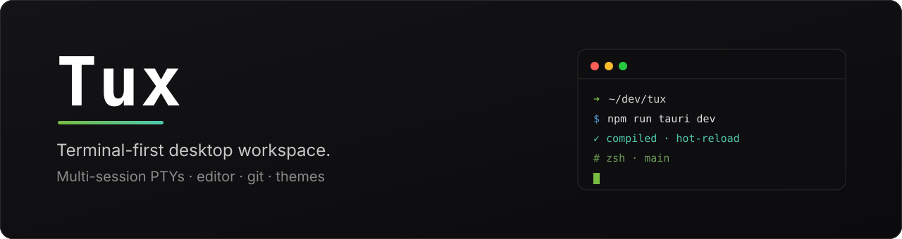
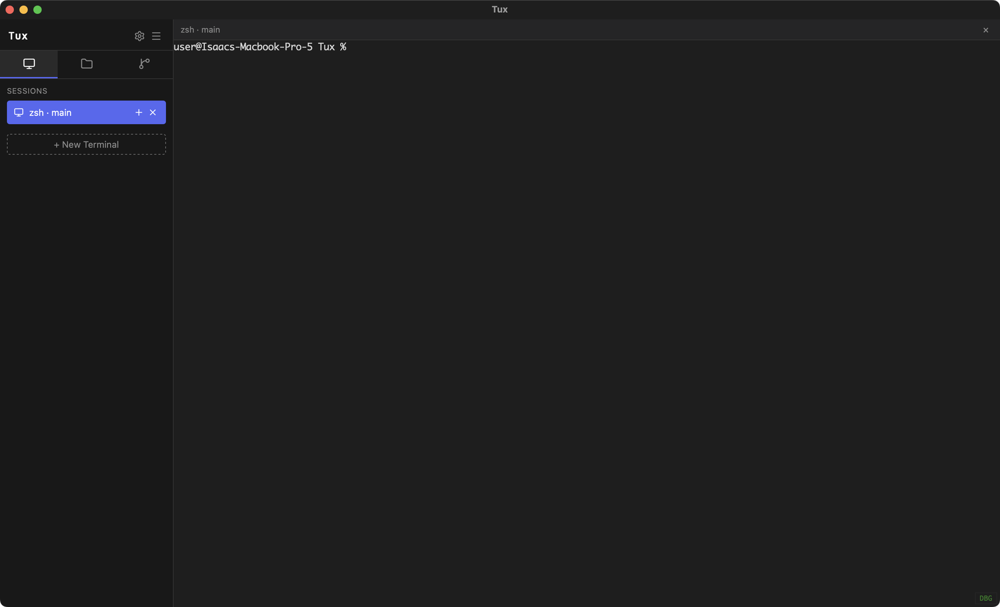
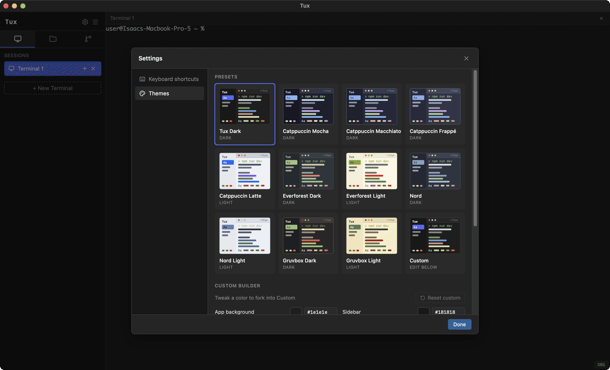
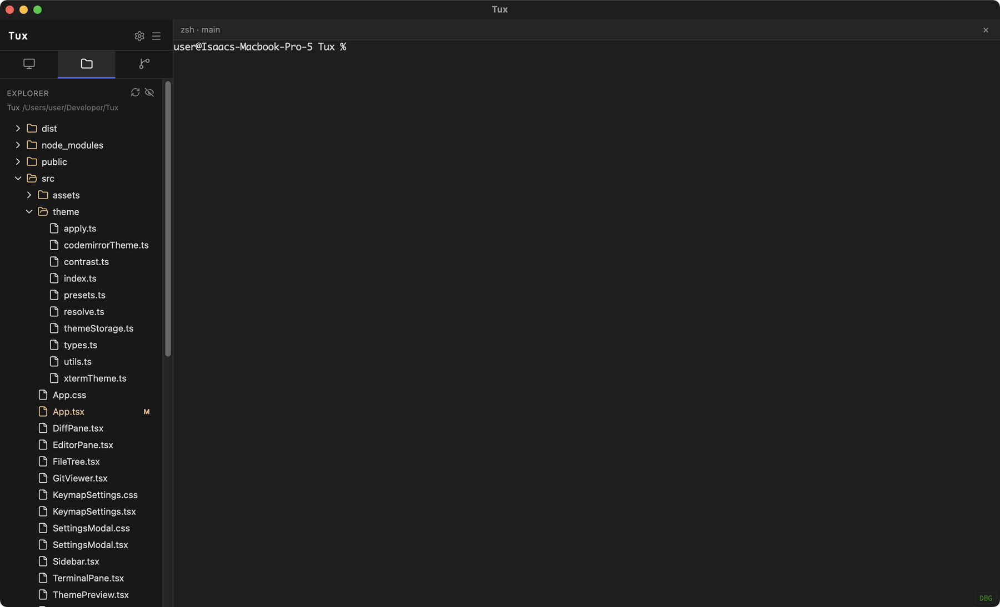
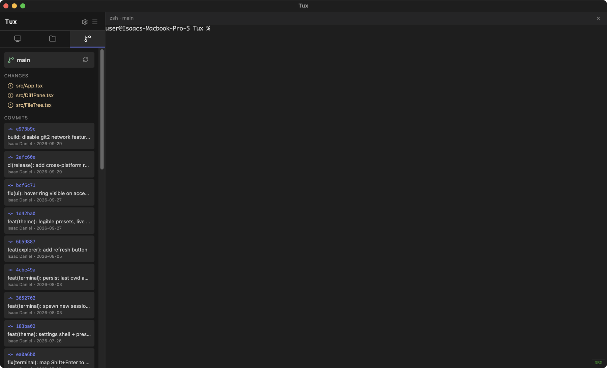
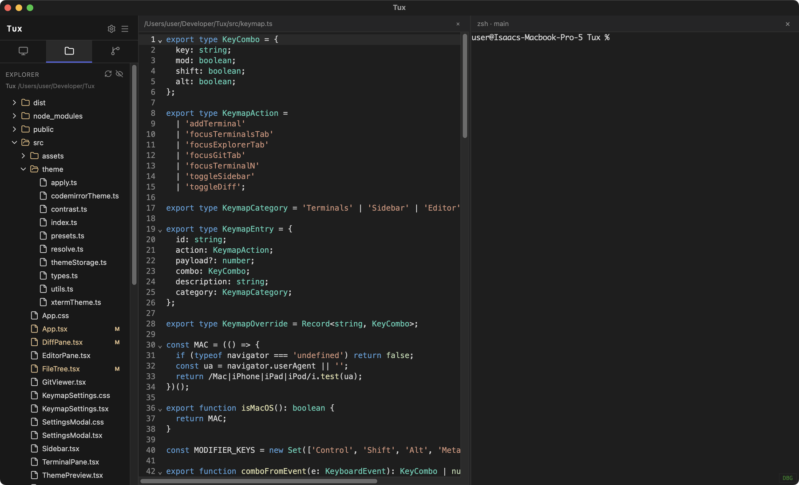
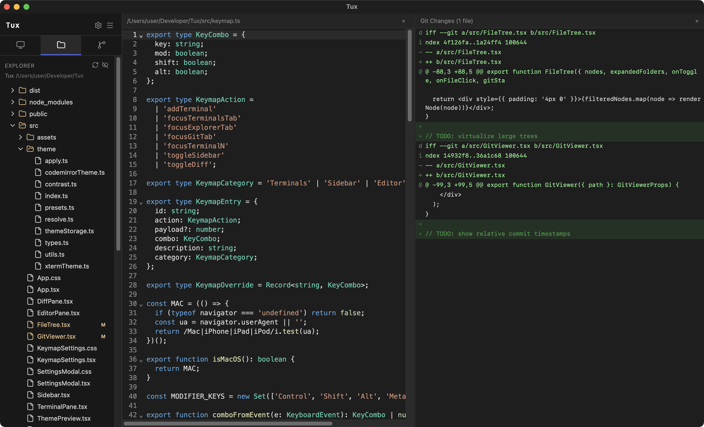
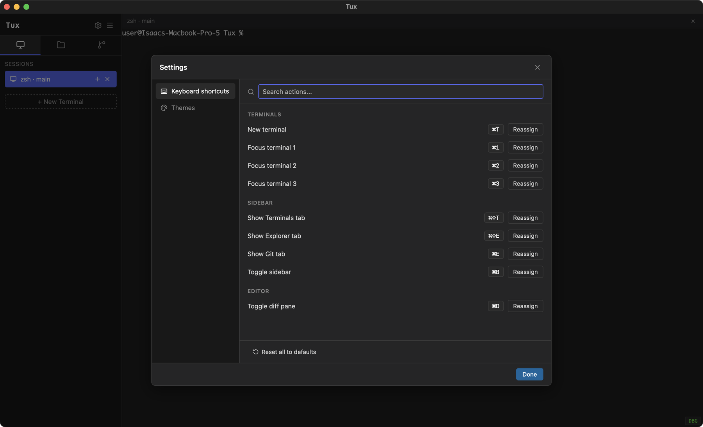

<p align="center">
  
</p>

<p align="center">
  <a href="https://github.com/Isaac-1555/Tux/releases/latest"></a>
  
  
</p>

**Tux** is a terminal-first desktop workspace. Multiple PTY-backed sessions, a lightweight editor, a file explorer, and git integration — in one native, keyboard-driven window. Built for shell-first developers and AI coding agents that live in the terminal.

---

## Download

Grab the latest build from the **[Releases page »](https://github.com/Isaac-1555/Tux/releases/latest)**

| Platform | File to download | Notes |
|---|---|---|
| **macOS** (Apple Silicon + Intel) | `Tux_<version>_universal.dmg` | Universal binary — works on both chip types |
| **Windows** (x64) | `Tux_<version>_x64-setup.exe` | Installer (recommended) |
| | `Tux_<version>_x64_en-US.msi` | MSI package, for managed deployments |
| **Linux** (x64) | `Tux_<version>_amd64.AppImage` | Portable, no install needed |
| | `Tux_<version>_amd64.deb` | Debian / Ubuntu |
| | `Tux-<version>-1.x86_64.rpm` | Fedora / RHEL |

> **These builds are not code-signed.** The first launch triggers a security warning — this is expected. Follow the steps below to open it.

### macOS

1. Download `Tux_<version>_universal.dmg`.
2. Open the `.dmg` and drag **Tux** into **Applications**.
3. First launch only: **right-click (or Control-click) the Tux icon → Open → Open**.
   (Double-clicking a first launch is blocked by Gatekeeper for unsigned apps. After the first `Open`, normal double-click works.)

Or via Terminal:

```bash
hdiutil attach ~/Downloads/Tux_*_universal.dmg
cp -R /Volumes/Tux*/Tux.app /Applications/
xattr -dr com.apple.quarantine /Applications/Tux.app
open /Applications/Tux.app
```

### Windows

1. Download `Tux_<version>_x64-setup.exe` and run it.
2. If SmartScreen appears: **More info → Run anyway**.
3. Launch **Tux** from the Start menu.

### Linux

**AppImage** (no install):

```bash
chmod +x Tux_*_amd64.AppImage
./Tux_*_amd64.AppImage
```

**Debian / Ubuntu:**

```bash
sudo apt install ./Tux_<version>_amd64.deb
```

**Fedora / RHEL:**

```bash
sudo rpm -i Tux-<version>-1.x86_64.rpm
```

---

## Quick start

When Tux opens, a login shell session is already running.

<p align="center">
  
</p>

1. **Start a session** — one terminal opens automatically. Press <kbd>⌘T</kbd> (macOS) / <kbd>Ctrl+T</kbd> for another. Each session is an isolated PTY with its own working directory, branch, and foreground process.
2. **Run anything** — the shell is your login shell, so `PATH`, aliases, and shell integration all behave as in your terminal. The tab label updates live with the running command and git branch.
3. **Browse files** — open the **Explorer** tab (<kbd>⌘⇧E</kbd>). The tree follows the active session's directory. Click a file to open it in the editor.
4. **Check git** — the **Git** tab (<kbd>⌘E</kbd>) shows the current branch, changed files, and recent commits. Open a diff next to the editor with <kbd>⌘D</kbd>.
5. **Make it yours** — the gear icon opens **Settings**: rebind any shortcut or pick a theme. Both persist across launches.
6. **Close and relaunch** — sessions, their last working directory, window size, theme, and keybindings all restore.

<p align="center">
  
</p>

---

## Features

### Multiple terminals

Every session is a real PTY running your login shell. Tabs show the live command and git branch; each session tracks its own directory — spawn a new one *in the same directory* with the ⊕ button next to a session.

<p align="center">
  
</p>

### File explorer

A folder tree with git status overlays (`M` modified, `A` added, `D` deleted). Syncs to the active session's working directory; toggle hidden files with the eye icon.

<p align="center">
  
</p>

### Git integration

Branch, changed files, and scrollable commit history — all read live from the active repository.

<p align="center">
  
</p>

### Editor

CodeMirror 6 with syntax highlighting for HTML, CSS, JS/TS, JSON, and Markdown — opens side by side with the terminal and a draggable divider.

<p align="center">
  
</p>

### Diff viewer

Open the editor and the diff pane together to review working-tree changes without leaving the app.

<p align="center">
  
</p>

### Themes

Eleven built-in presets (Catppuccin, Everforest, Nord, Gruvbox, Tux Dark — each with light and dark variants) plus a custom builder. Everything recolors live: UI, terminal, and editor.

<p align="center">
  
</p>

### Customizable keymap

Every shortcut is data-driven and rebindable. Conflicts are detected inline before a binding is saved.

<p align="center">
  
</p>

### Under the hood

- **Login shell by default** — PTYs spawn with `-l` / `-Login`, so `path_helper`, `/etc/paths.d/*`, Homebrew, and `~/.zprofile` populate `PATH` correctly.
- **Shell integration (OSC 7999)** — command start/end and cwd changes stream back to the UI for live tab titles.
- **GPU terminal** — xterm.js WebGL renderer with device-pixel-ratio handling; falls back to canvas when unavailable.
- **Rich TUI support** — advertises `TERM=xterm-256color`, `COLORTERM=truecolor`, `TERM_PROGRAM=ghostty`, so image-capable TUIs (opencode, claude code) render inline graphics via SIXEL / iTerm2 / kitty protocols.
- **Persistence** — sessions + cwd, keymap overrides, and theme save automatically; window state is restored on launch.

---

## Keyboard shortcuts

Defaults from [`src/keymap.ts`](src/keymap.ts). All rebindable via **Settings → Keyboard shortcuts**.

| Action | macOS | Linux / Windows |
|---|---|---|
| New terminal | <kbd>⌘T</kbd> | <kbd>Ctrl+T</kbd> |
| Focus terminal 1/2/3 | <kbd>⌘1</kbd> <kbd>⌘2</kbd> <kbd>⌘3</kbd> | <kbd>Ctrl+1</kbd> <kbd>Ctrl+2</kbd> <kbd>Ctrl+3</kbd> |
| Toggle sidebar | <kbd>⌘B</kbd> | <kbd>Ctrl+B</kbd> |
| Show Terminals tab | <kbd>⌘⇧T</kbd> | <kbd>Ctrl+Shift+T</kbd> |
| Show Explorer tab | <kbd>⌘⇧E</kbd> | <kbd>Ctrl+Shift+E</kbd> |
| Show Git tab | <kbd>⌘E</kbd> | <kbd>Ctrl+E</kbd> |
| Toggle diff pane | <kbd>⌘D</kbd> | <kbd>Ctrl+D</kbd> |
| Toggle terminal debug overlay | in-pane `DBG` button | in-pane `DBG` button |

---

## Development

**Prerequisites:** Node 20+, Rust stable (1.77.2+), and the platform Tauri dependencies — see the [Tauri prerequisites guide](https://tauri.app/start/prerequisites/).

```bash
npm install
npm run tauri dev          # Vite + Rust with hot-reload
```

Rust-only checks:

```bash
cd src-tauri && cargo check
```

### Build locally

```bash
npm run tauri build
```

Artifacts land in `src-tauri/target/release/bundle/`. A cold release build takes several minutes; use `npm run tauri dev` for iteration.

### Releases

Releases are built by [`.github/workflows/release.yml`](.github/workflows/release.yml) on any `v*` tag. The matrix produces the macOS universal `.dmg`, Windows `.msi` / `.exe`, and Linux `.deb` / `.rpm` / `.AppImage`, then publishes a GitHub Release.

```bash
git tag v1.0.1 && git push origin v1.0.1   # triggers a build + release
```

---

## Stack

| Layer | Tech |
|---|---|
| Shell | [Tauri](https://tauri.app/) 2.x |
| Frontend | React 19 + TypeScript + Vite |
| Editor | CodeMirror 6 (`@uiw/react-codemirror`) |
| Terminal | [xterm.js](https://xtermjs.org/) 6 + `fit`, `webgl`, `image`, `web-links` addons |
| Diff viewer | [`@pierre/diffs`](https://github.com/pierrecmr/diffs) |
| PTY | Rust [`portable-pty`](https://github.com/wez/wezterm/tree/main/pty) |
| Git | [`git2-rs`](https://github.com/rust-lang/git2-rs) |
| State | `@tauri-apps/plugin-store` |
| Icons | `lucide-react` |

## Project structure

```
.
├── src/                       # React frontend
│   ├── App.tsx                # Root layout + state owner
│   ├── Sidebar.tsx            # Sessions / Explorer / Git tabs
│   ├── TerminalPane.tsx       # xterm.js + PTY lifecycle
│   ├── EditorPane.tsx         # CodeMirror editor
│   ├── DiffPane.tsx           # Diff viewer
│   ├── FileTree.tsx           # Folder tree with git overlays
│   ├── GitViewer.tsx          # Branch, status, commits
│   ├── SettingsModal.tsx      # Settings shell (Keyboard / Themes)
│   ├── keymap.ts              # DEFAULT_KEYMAP + match/format/conflict
│   └── theme/                 # tokens, presets, apply, storage
├── src-tauri/                 # Rust backend
│   ├── src/
│   │   ├── lib.rs             # Tauri builder + command registry
│   │   ├── pty.rs             # PTY spawn/io, shell integration, metadata
│   │   ├── fs.rs              # read_dir, read_file, write_file
│   │   └── git.rs             # status, branch, diff, log
│   └── tauri.conf.json        # Bundle config
├── docs/assets/               # README images
├── PRD.md                     # Product requirements
└── AGENTS.md                  # Agent-facing project guide
```

---

## Troubleshooting

- **macOS says the app is damaged / can't be opened** — it's unsigned. Right-click → **Open**, or clear the quarantine flag: `xattr -dr com.apple.quarantine /Applications/Tux.app`.
- **Windows SmartScreen blocks the installer** — **More info → Run anyway**.
- **`command not found` in a fresh session** — sessions spawn as login shells by design. If `PATH` looks wrong, check your shell profile, not Tux.
- **Terminal is blank or shows no glyphs** — usually a font load race; the pane awaits `document.fonts.ready` before opening. Check dev tools for font 404s.
- **WebGL renderer unavailable** — Tux falls back to canvas automatically. Use the in-pane `DBG` button to inspect DPR and render size.
- **Git tab is empty** — it reads the *active session's* directory. `cd` into a repository (or open a session there) to populate it.
- **Keymap override not applied** — overrides save immediately; if a combo collides with another action, the settings modal shows the conflict inline.

## License

Private project. License TBD.
